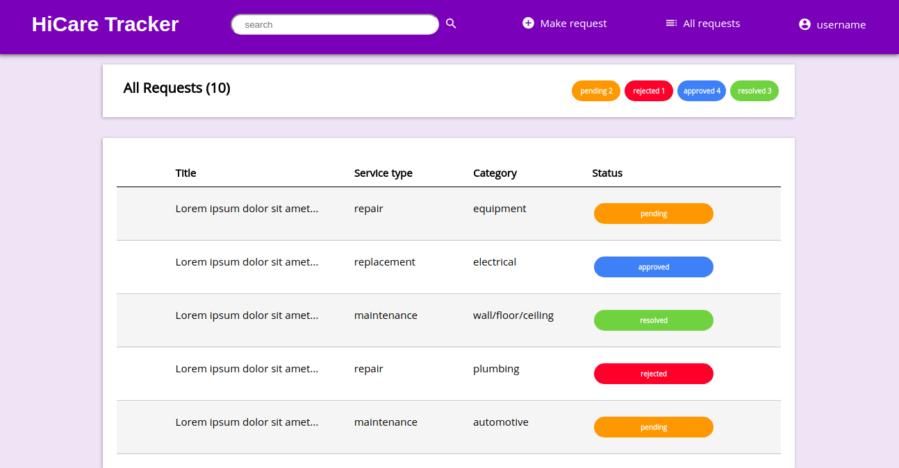

 [](https://travis-ci.org/asamisellah/Maintenance-Tracker) [](https://coveralls.io/github/asamisellah/Maintenance-Tracker?branch=api-develop)

# <span style="color:#673ab7">Maintenance Tracker App</span>

Maintenance Tracker App is an application that enables users to reach out to operations or repairs department regarding repair or maintenance requests and monitor the status of their request.

## Preview

Get started [live preview](https://asamisellah.github.io/Maintenance-Tracker/)



## Usage

To make requests and track their status using Maintenance Tracker, follow the steps below:

* Create an account by signing up
* Sign in with your username and password
* Make a request
* Request is approved or disapproved
* If approved, you get service

## Download and Installation

To install this project:

1.  Download repository zip [here](https://github.com/asamisellah/Maintenance-Tracker)
2.  Unzip the repository in your local disk
3.  Open project in your preffered text editor

### Alternatively

In, your terminal;

1.  Cd to where you would like to install the project
2.  Run

```
$ git clone git@github.com:asamisellah/Maintenance-Tracker.git
```

3.  Navigate to Maintenance-Tracker folder
4.  Open `index.html` using your preferred browser

<!-- ### Built with

* HTML/ CSS/ Javascript -->

## API

### Prerequisites

* Virtual Environment
* Python 3.5 or later version
* Flask-RESTful

### Endpoints

## License

This project is licensed under **MIT License**

## Acknowledgments

* <span style="color:#673ab7">**Andela Kenya**</span> for the opportunity
* <span style="color:#673ab7">**Andela Bootcamp (Cohort 28)**</span> community for support and reviews

## Author

**Rachael Asami** -- -_[github.com/asamisellah](https://github.com/asamisellah)_
